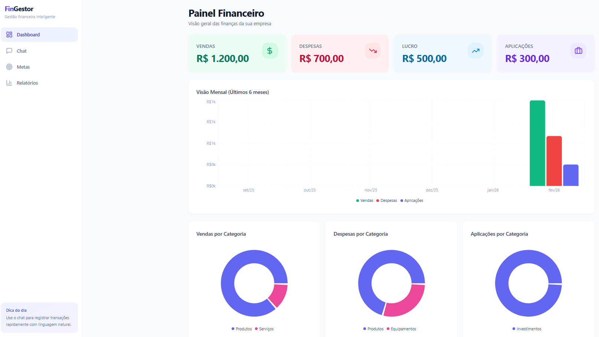

# 💰 FinGestor — Intelligent Financial Management App

## 🌍 Overview / Visão Geral

**EN:**  
**FinGestor** is a **production-ready financial management web application** created to help companies monitor, analyze, and improve their financial performance.

The application was built using the **:contentReference[oaicite:0]{index=0}** platform, leveraging AI-assisted development to rapidly deliver a complete solution with dashboards, reports, and automation — without traditional backend or frontend coding.

**PT-BR:**  
**FinGestor** é uma **aplicação web de gestão financeira pronta para produção**, criada para ajudar empresas a monitorar, analisar e melhorar seu desempenho financeiro.

A aplicação foi desenvolvida utilizando a plataforma **Base44**, explorando desenvolvimento assistido por IA para entregar rapidamente uma solução completa com dashboards, relatórios e automações — sem a necessidade de programação tradicional de frontend ou backend.

---

## 🎯 Project Context / Contexto do Projeto

**EN — Problem:**  
Small and medium-sized businesses often lack a centralized and clear financial view, relying on spreadsheets or disconnected tools.

**EN — Solution:**  
FinGestor acts as a **single financial control center**, combining real-time indicators, historical analysis, goal tracking, and a smart chat interface for fast data entry.

**EN — Result:**  
A clean, intuitive, and scalable application that improves financial visibility and supports better decision-making.

---

**PT-BR — Problema:**  
Pequenas e médias empresas frequentemente não possuem uma visão financeira centralizada e clara, dependendo de planilhas ou ferramentas desconectadas.

**PT-BR — Solução:**  
O FinGestor funciona como um **centro único de controle financeiro**, combinando indicadores em tempo real, análises históricas, acompanhamento de metas e um chat inteligente para entrada rápida de dados.

**PT-BR — Resultado:**  
Uma aplicação limpa, intuitiva e escalável, que melhora a visibilidade financeira e apoia a tomada de decisões estratégicas.

---

## 📊 Key Features / Funcionalidades Principais

- **Financial Dashboard / Painel Financeiro**  
  Overview of sales, expenses, profits, and investments  
  Visão geral de vendas, despesas, lucros e aplicações

- **Monthly Performance Charts / Gráficos Mensais**  
  Visual tracking of financial evolution over the last six months  
  Acompanhamento visual da evolução financeira dos últimos seis meses

- **Detailed Categories / Categorias Detalhadas**  
  Transaction breakdown by type and category  
  Distribuição de transações por tipo e categoria

- **Financial Goals Tracking / Metas Financeiras**  
  Definition and monitoring of strategic objectives  
  Definição e acompanhamento de objetivos estratégicos

- **Custom Reports / Relatórios Personalizados**  
  Structured reports for deeper analysis  
  Relatórios estruturados para análise detalhada

- **Smart Chat Interface / Chat Inteligente**  
  Register financial transactions using natural language  
  Registro de transações financeiras por linguagem natural

- **Daily Tips / Dicas do Dia**  
  Contextual suggestions to improve system usage  
  Sugestões contextuais para melhor uso do sistema

---

## 🖼️ Application Preview / Visual da Aplicação

### Main Dashboard / Dashboard Principal

> **EN:** The dashboard presents key financial indicators, historical charts, and categorized data in a clear, business-oriented layout.  
> **PT-BR:** O dashboard apresenta indicadores financeiros, gráficos históricos e dados categorizados de forma clara e orientada ao negócio.

---

## 🛠️ Technologies & Tools / Tecnologias & Ferramentas

**EN:**
- **Base44** — AI-powered low-code / no-code application platform  
- **Responsive Web Interface** — Optimized for desktop and mobile  
- **Integrated Backend** — Authentication, database, and business logic  
- **Cloud Deployment** — Hosted via Base44 infrastructure  

**PT-BR:**
- **Base44** — Plataforma low-code / no-code com IA  
- **Interface Web Responsiva** — Otimizada para desktop e mobile  
- **Backend Integrado** — Autenticação, banco de dados e regras de negócio  
- **Deploy em Nuvem** — Hospedado na infraestrutura da Base44  

---

## 🚀 Live Demo / Aplicação Online

🔗 https://basefinance.base44.app

**EN:** Fully deployed and accessible online.  
**PT-BR:** Aplicação totalmente publicada e acessível online.

---

## 🧠 Skills Demonstrated / Competências Demonstradas

**EN:**
- Product thinking and problem-solving  
- Financial domain understanding  
- UI/UX design for business dashboards  
- Data organization and reporting logic  
- AI-assisted and no-code development  
- Rapid prototyping and deployment  
- Technical documentation and presentation  

**PT-BR:**
- Visão de produto e resolução de problemas  
- Conhecimento do domínio financeiro  
- Estruturação de UI/UX para dashboards corporativos  
- Organização de dados e lógica de relatórios  
- Desenvolvimento assistido por IA e no-code  
- Prototipação rápida e deploy  
- Documentação técnica e apresentação de projetos  

---

## 📈 Roadmap

- [ ] Export reports to PDF and Excel  
      Exportação de relatórios em PDF e Excel  
- [ ] Multi-currency support  
      Suporte a múltiplas moedas  
- [ ] Bank integration via Open Finance  
      Integração bancária via Open Finance  
- [ ] Advanced financial planning module  
      Módulo avançado de planejamento financeiro  

---

## 🤝 Contributions / Contribuições

**EN:** Contributions and suggestions are welcome.  
Open an *issue* or submit a *pull request*.

**PT-BR:** Contribuições e sugestões são bem-vindas.  
Abra uma *issue* ou envie um *pull request*.

---

## 📄 License / Licença

**EN:** This project is licensed under the **MIT License**.  
See the `LICENSE` file for more details.

**PT-BR:** Este projeto está licenciado sob a **Licença MIT**.  
Consulte o arquivo `LICENSE` para mais informações.
